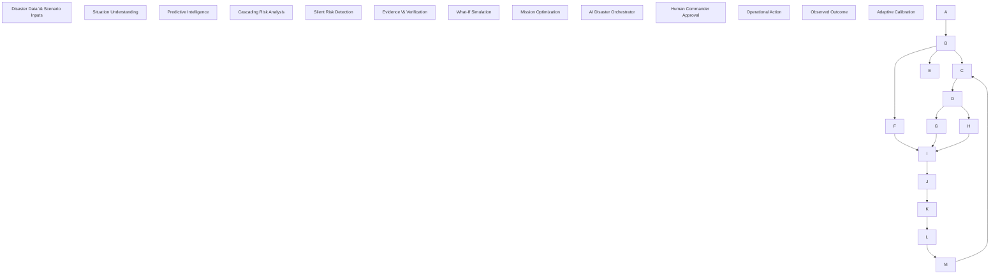
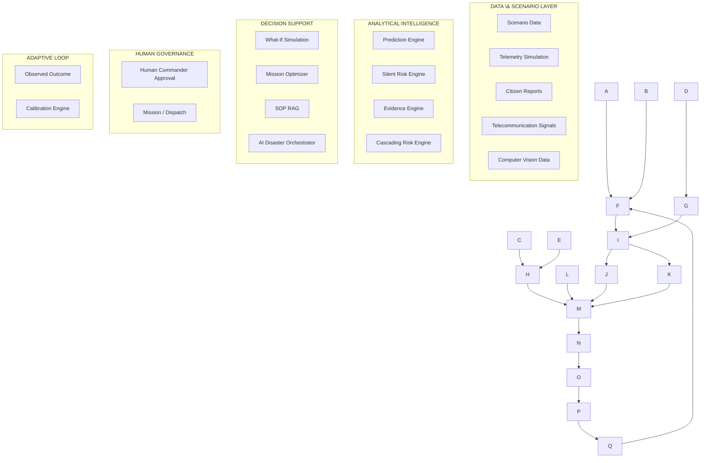

🛡️ AEGIS
AI Emergency & Geospatial Intelligence System
> **See the disaster. Predict the next crisis. Act before it happens.**
📌 Quick Navigation
About · Problem · Solution · Features · Architecture · Tech Stack · Setup · Testing · Demo · Team
---
🚨 About AEGIS
AEGIS (AI Emergency & Geospatial Intelligence System) is an AI-powered disaster intelligence and decision-support platform designed to help emergency-response teams move from reactive response to predictive action.
Instead of simply displaying disaster information on a map, AEGIS attempts to answer:
What is happening right now?
What is likely to happen next?
Which areas may become critical?
What secondary failures could occur?
Which rescue mission should be prioritized?
What happens if we take a particular action?
How can the system learn from the outcome?
AEGIS follows a complete disaster intelligence lifecycle:
```text
DETECT
   ↓
UNDERSTAND
   ↓
PREDICT
   ↓
SIMULATE
   ↓
DECIDE
   ↓
ACT
   ↓
LEARN
```
---
🎯 Hackathon
AUTOMATE INDIA 2026 — NIET CHAPTER
Team: The Catalyst
Problem Statement:  AI-01 — AI Disaster Response Intelligence Platform
Theme:  Generative AI
Institution:  Noida Institute of Engineering and Technology (NIET)
🚨 Problem Statement
During disasters such as floods, cyclones, earthquakes, and urban inundation, emergency-response teams have to make decisions using information that is fragmented, rapidly changing, and sometimes incomplete.
Some of the major challenges include:
Reactive Response
Traditional dashboards often show what has already happened rather than what is likely to happen next.
By the time a response team reaches a reported location, roads or access routes may already have become unusable.
Cascading Failures
A disaster rarely affects only one system.
For example:
```text
Flooding
   ↓
Road Blockage
   ↓
Hospital Access Reduced
   ↓
Medical Response Delayed
   ↓
Higher Operational Risk
```
AEGIS models these relationships to identify secondary and cascading risks.
3. Silent Crisis
A lack of SOS reports does not necessarily mean that an area is safe.
Communication outages, infrastructure failures, or network loss can prevent affected populations from reporting their situation.
AEGIS therefore considers communication anomalies and population exposure when identifying potentially silent-risk zones.
4. Nearest Does Not Always Mean Best
The closest rescue vehicle may not be suitable for the situation.
A vehicle's capabilities, water clearance, medical resources, and operational constraints can be more important than simple geographic distance.
5. No Pre-Execution Testing
Emergency commanders often need to choose between multiple interventions without knowing how each action may affect the overall risk.
AEGIS provides a What-If Simulation Sandbox to compare possible interventions before deployment.
6. Lack of Feedback
Disaster-response systems can remain static after an event.
AEGIS includes an adaptive feedback loop that compares predicted outcomes with observed outcomes and uses the difference for calibration.
💡 Our Solution
AEGIS transforms disaster management from a passive information dashboard into an active predictive decision-support system.
Instead of only showing:
> "This area is flooded."
AEGIS aims to provide:
> "This area is becoming critical, this secondary failure may occur next, this mission has the highest suitability, and this intervention can reduce the projected risk."
The system combines:
Predictive Intelligence
Cascading Risk Analysis
Silent Risk Detection
Evidence Verification
Computer Vision-based Damage Assessment
Mission Optimization
What-If Simulation
SOP-based Retrieval-Augmented Generation
Multi-Agent AI Orchestration
Adaptive Intelligence
---
🧠 How AEGIS Works

Core principle
> **AI recommends. Humans authorize. Operations execute.**
This keeps the system focused on decision support rather than autonomous emergency command.
---
✨ Key Features
1. 🔮 Predictive Intelligence Engine
AEGIS provides multi-horizon disaster forecasting across:
T+0
T+30 minutes
T+60 minutes
T+180 minutes
The system can also calculate projected time-to-isolation and secondary vulnerabilities across:
Roads
Medical access
Power
Water
Telecommunications
2. 🔗 Cascading Risk Intelligence
AEGIS models dependencies between infrastructure and disaster conditions using graph-based risk propagation.
Example:
```text
River Level Increase
        ↓
Bridge Inundation
        ↓
Road Accessibility ↓
        ↓
Hospital Access ↓
        ↓
Medical Response Risk ↑
```
The system uses NetworkX-based dependency graphs to represent multi-hop relationships between infrastructure components.
3. 👻 Silent Risk Detection
One of AEGIS's key ideas is:
> **No SOS does not always mean no crisis.**
The Silent Risk Engine identifies potentially dangerous zones where:
Disaster severity is high
Population exposure exists
Communication activity is unexpectedly low
Infrastructure/network anomalies are present
This helps surface areas that might otherwise be overlooked.
---
4. 🕵️ Evidence & Multi-Source Verification
Disaster information can be incomplete or conflicting.
AEGIS provides an evidence and provenance layer that:
Tracks operational claims
Assigns confidence
Correlates available information
Maintains decision traceability
Provides evidence-backed context for AI recommendations
The system is designed to reduce reliance on unsupported AI-generated claims.
5. 🚑 Capability-Aware Mission Optimization
AEGIS does not simply select the nearest rescue team.
It evaluates operational suitability using factors such as:
Distance
Water clearance capability
Boat availability
Medical equipment
Crew capability
Safety constraints
Example:
```text
Team R1
Distance: 2.1 km
Suitability: Lower

Team R2
Distance: 4.2 km
Rescue Boats: Available
Medical Capability: Available
Suitability: Higher
```
The system can therefore prioritize the most suitable mission, not merely the closest one.
6. 🧪 What-If Disaster Simulation
The What-If Sandbox allows emergency commanders to compare possible intervention strategies.
Example:
```text
WHAT IF?

☑ Evacuate Zone 7
☑ Deploy Rescue Team R2
☐ Intensify Weather Scenario
☐ Communication Failure
```
AEGIS compares the resulting risk trajectory and provides decision-support information before resources are deployed.
This makes the system useful not only for:
"What is happening?"
but also:
"What should we do?"
7. 🤖 AI Disaster Orchestrator
AEGIS includes a multi-agent AI orchestration layer that routes emergency queries through verified internal analytical tools.
Examples include:
```text
get\_current\_situation
get\_prediction
get\_cascading\_risks
run\_simulation
```
The orchestrator can combine outputs from different analytical components and present them in an operational context.
8. 📚 SOP Retrieval-Augmented Generation
AEGIS includes a grounded SOP knowledge layer for disaster-response procedures.
The RAG layer provides contextual retrieval from operational procedure documents and connects retrieved information with the AI orchestration workflow.
This allows the system to provide responses grounded in the available operational knowledge base instead of relying only on free-form generation.
9. 🔄 Adaptive Intelligence
AEGIS includes a closed-loop learning concept:
```text
Prediction
    ↓
Operational Outcome
    ↓
Observed Ground Truth
    ↓
Error Detection
    ↓
Calibration
    ↓
Improved Future Prediction
```
The adaptive engine tracks predicted versus observed outcomes and applies calibration adjustments to improve future forecasts.
10. 🗺️ Tactical Geospatial & Computer Vision Intelligence
AEGIS provides a geospatial operational interface using MapLibre GL.
The interface supports:
Disaster-zone visualization
Risk overlays
Road accessibility
Fleet locations
GeoJSON layers
Tactical map interaction
The project also contains a Computer Vision damage-assessment service for aerial/satellite-style disaster assessment workflows.
> The current hackathon demonstration uses simulated data rather than live external disaster feeds.
---
🎯 Why AEGIS Is Different
Capability	Conventional Dashboard	AEGIS
Situation Awareness	Shows current state	Understands current state
Future Risk	Limited	Multi-horizon prediction
Cascading Effects	Usually isolated	Dependency-based risk propagation
Silent Areas	May appear safe	Silent-risk anomaly detection
Mission Selection	Often nearest asset	Capability-aware optimization
Intervention Planning	Manual	What-If simulation
AI Responses	Generic generation	Tool + SOP grounded orchestration
Learning	Static	Adaptive feedback loop
The central difference is:		
> **AEGIS is designed around decision intelligence, not just information visualization.**
---
🌊 Demonstration Scenario
Flood Event — Northern Corridor
AEGIS currently demonstrates its capabilities through a deterministic flood-response scenario.
The demo allows the system to illustrate:
```text
Current Situation
      ↓
Risk Detection
      ↓
Prediction Horizons
      ↓
Cascading Failures
      ↓
Silent Risk Zones
      ↓
Evidence Verification
      ↓
Mission Optimization
      ↓
What-If Simulation
      ↓
Adaptive Feedback
```
Important Note
The current hackathon demo uses simulated/deterministic disaster data.
It is designed to demonstrate the intelligence and decision-support pipeline without depending on live external disaster feeds.
🏗️ System Architecture

---
🛠️ Technology Stack
Layer	Technology	Purpose
Frontend	React + TypeScript	Interactive operational dashboard
Build Tool	Vite	Frontend development/build
Styling	Tailwind CSS / Tactical UI styling	Interface design
Mapping	MapLibre GL	Geospatial visualization
Backend	FastAPI	REST API and backend services
Language	Python	Intelligence and backend services
Graph Analysis	NetworkX	Cascading-risk dependency graph
AI Orchestration	Multi-Agent Tool Router	AI tool coordination
RAG	In-memory SOP Vector Store	Grounded procedural retrieval
Computer Vision	CV Service	Aerial/satellite-style damage assessment
Testing	Pytest	Backend/unit/integration testing
API Documentation	Swagger / ReDoc	Backend API documentation
📂 Project Structure
```text
AEGIS/
│
├── backend/
│   ├── app/
│   │   ├── engines/
│   │   │   ├── adaptive/
│   │   │   ├── cascading/
│   │   │   ├── evidence/
│   │   │   ├── mission/
│   │   │   ├── prediction/
│   │   │   ├── simulation/
│   │   │   └── ...
│   │   │
│   │   ├── rag/
│   │   ├── silent\_risk\_engine.py
│   │   ├── config.py
│   │   └── main.py
│   │
│   ├── requirements.txt
│   └── tests/
│
├── frontend/
│   ├── src/
│   │   ├── components/
│   │   ├── context/
│   │   ├── pages/
│   │   ├── services/
│   │   └── types/
│   │
│   ├── package.json
│   ├── tailwind.config.js
│   ├── tsconfig.json
│   └── vite.config.ts
│
├── .env.example
├── package.json
├── LICENSE
└── README.md
```
---
🚀 Quick Start
Prerequisites
Node.js 18+
Python 3.10+
npm
pip
Clone the Repository
```bash
git clone https://github.com/sankettiwari943-coder/AEGIS.git
cd AEGIS
```
---
Environment Configuration
If environment configuration is required:
```bash
cp .env.example .env
```
> Do not commit API keys, passwords, tokens, or other secrets to GitHub.
AEGIS's current demonstration does not require a live Gemini API connection.
---
Backend Setup
```bash
cd backend

pip install -r requirements.txt

python -m uvicorn app.main:app --host 127.0.0.1 --port 8000 --reload
```
Backend:
```text
http://127.0.0.1:8000
```
Swagger API documentation:
```text
http://127.0.0.1:8000/docs
```
---
Frontend Setup
Open a second terminal:
```bash
cd frontend

npm install

npm run dev
```
Frontend:
```text
http://localhost:5173
```
---
🎮 Demo Navigation
AEGIS provides dedicated operational views for the major parts of the intelligence lifecycle.
View	Purpose
COMMAND	Operational overview and priority alerts
LIVE HUD	Tactical GIS and situation visualization
PREDICT	Forward risk horizons
SIMULATE	What-If intervention analysis
MISSIONS	Mission ranking and authorization
EVIDENCE	Evidence and silent-risk analysis
ADAPTIVE	Feedback and calibration
AI	AI Disaster Orchestrator and SOP RAG
🧪 Automated Testing
AEGIS includes an automated backend test suite covering the major analytical engines and API components.
Run:
```bash
$env:PYTHONPATH="backend"; python -m pytest backend/tests
```
Current Test Status
```text
84 tests
84 passed
0 failed
```
The test suite includes coverage for:
Adaptive Engine
AI Orchestrator
API
Cascading Engine
Computer Vision Service
Evidence Engine
Ingestion Service
Mission Optimizer
Prediction Engine
RAG Service
Simulation Engine
Integration workflows
📸 Screenshots
> Screenshots will be added before final submission.
Command Center
[ SCREENSHOT PLACEHOLDER — ADD COMMAND CENTER SCREENSHOT HERE ]
---
Live Tactical HUD
[ SCREENSHOT PLACEHOLDER — ADD LIVE HUD SCREENSHOT HERE ]
Prediction Intelligence
[ SCREENSHOT PLACEHOLDER — ADD PREDICTION SCREENSHOT HERE ]
Evidence & Silent Risk
[ SCREENSHOT PLACEHOLDER — ADD EVIDENCE SCREENSHOT HERE ]
Mission Optimization
[ SCREENSHOT PLACEHOLDER — ADD MISSIONS SCREENSHOT HERE ]
What-If Simulation
[ SCREENSHOT PLACEHOLDER — ADD SIMULATION SCREENSHOT HERE ]
Adaptive Intelligence
[ SCREENSHOT PLACEHOLDER — ADD ADAPTIVE SCREENSHOT HERE ]
AI Disaster Orchestrator
[ SCREENSHOT PLACEHOLDER — ADD AI SCREENSHOT HERE ]
🎥 Demo
Live Deployment
[ LIVE DEMO LINK — TO BE ADDED ]
Demo Video
[ DEMO VIDEO LINK — TO BE ADDED ]
🔐 Safety & Responsible AI
AEGIS is designed as a decision-support system, not an autonomous replacement for emergency authorities.
The system follows a human-in-the-loop principle:
```text
AI Analysis
    ↓
Recommendation
    ↓
Human Review
    ↓
Authorization
    ↓
Operational Action
```
The current hackathon implementation uses simulated disaster data and should not be treated as a production emergency-management system without further validation, real-world data integration, security hardening, and operational testing.
🔮 Future Scope
Future versions of AEGIS can expand toward:
Real-time disaster-data integrations
Live satellite and weather feeds
Additional disaster types
Larger-scale GIS deployments
Real emergency-service integrations
More advanced predictive models
Real-world field validation
Mobile responder applications
Larger SOP and knowledge bases
Production-grade authentication and security
👥 Team — The Catalyst
Member	Role
Sanket Tiwari	Team Leader
Apurva Diwedi	AI Developer
Ishant	Frontend Developer
Bhumi Chowdhary	Backend Developer
Hackathon
AUTOMATE INDIA 2026 — NIET CHAPTER
Institution:  
Noida Institute of Engineering and Technology (NIET)
📜 License
This project is distributed under the MIT License.
See the LICENSE file for details.
⚠️ Disclaimer
AEGIS is a hackathon prototype created for demonstrating AI-powered disaster intelligence and decision-support concepts.
The current demonstration uses simulated/deterministic disaster data and is not intended to provide real-world emergency instructions or replace trained disaster-response authorities.
Any deployment in a real emergency-management environment would require extensive validation, real-time data integration, security review, domain-expert oversight, and regulatory compliance.
🌐 Repository
GitHub:  
https://github.com/sankettiwari943-coder/AEGIS
---
<div align="center">
🛡️ AEGIS
AI Emergency & Geospatial Intelligence System
See the disaster. Predict the next crisis. Act before it happens.
Built by Team The Catalyst for AUTOMATE INDIA 2026 — NIET CHAPTER
</div>
